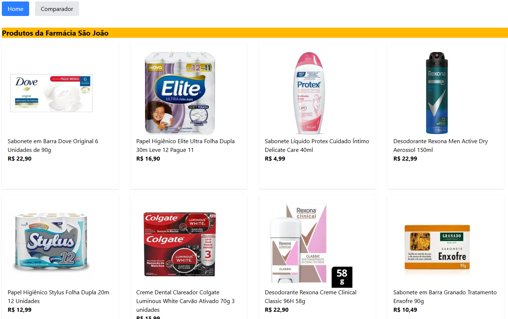
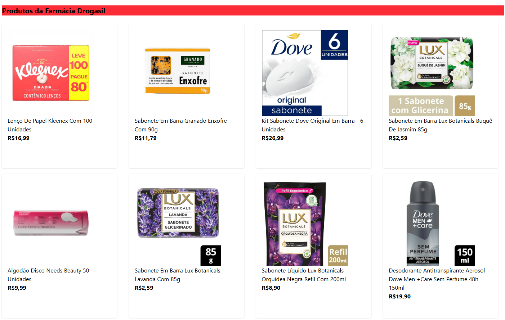
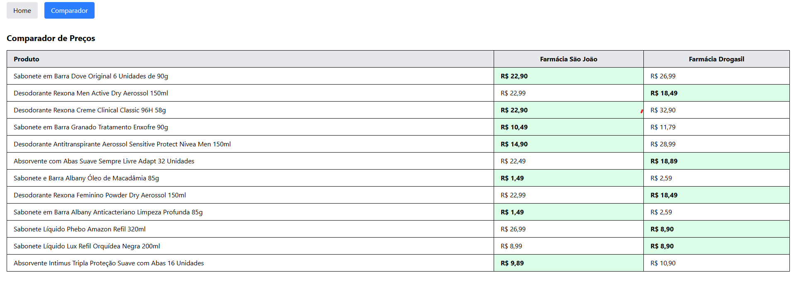

# 💊 Comparador de Preços entre Farmácias

Projeto fullstack em desenvolvimento que compara preços de produtos entre farmácias online. Utiliza **React + Tailwind CSS** no frontend e **Node.js + Express + Puppeteer** no backend para realizar scraping e exibir os dados de forma organizada.

> Este projeto está em andamento e serve como prática dos meus estudos em **web scraping**, **desenvolvimento fullstack** e **integração frontend/backend**.

---

## Funcionalidades atuais

✅ Web scraping em farmácias como Panvel, Drogasil, São João  
✅ Exibição dos produtos em **cards separados por farmácia**  
✅ Aba de **comparação com tabela** entre farmácias  
✅ Destaque do menor preço por produto na comparação

---

## Interface

### Página de Produtos

- Mostra produtos organizados por farmácia
- Cada item é exibido em um **card** com nome, preço e link

## Screenshots

---

### Página de Comparação

- Tabela com farmácias como colunas e produtos como linhas
- Produto mais barato é destacado por linha

## Tela de Comparação

## Tecnologias

### Backend

- Node.js
- Express
- Puppeteer

### Frontend

- React
- Tailwind CSS
- Vite

---

## Próximos passos

- [ ] Adicionar novas farmácias (DrogaRaia, Drogasil, Pague Menos)
- [ ] Filtro por faixa de preço, categoria ou marca
- [ ] Validação de entradas e mensagens de erro
- [ ] Deploy (Vercel para o frontend, Render para o backend)

---
